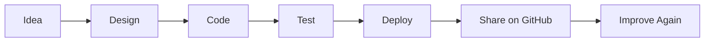

<div align="center">

# Hi, I'm DolphinCV

### Front-End Developer | Creative Coder | Portfolio Builder

[](https://dolphincv.netlify.app/)
[](https://github.com/)
[](https://dolphincv.netlify.app/)

I build responsive, modern, and interactive web experiences with clean UI, useful features, and a little bit of fun.

**Explore my work:** [dolphincv.netlify.app](https://dolphincv.netlify.app/)

</div>

---

## Welcome To My GitHub

I enjoy turning ideas into projects that people can click, test, play with, and remember. My work focuses on front-end development, portfolio experiences, responsive layouts, and creative web interactions.

```txt
Current mode: building, learning, improving
Favorite zone: interactive web experiences
Mission: make simple ideas feel alive on screen
```

---

## Tech Stack

<div align="center">


</div>

---

## Portfolio Map



---

## Live Snake Game

This README has a live Snake animation that eats my GitHub contribution graph.

<div align="center">


</div>

<details>
<summary><strong>How The Snake Works</strong></summary>

GitHub README files cannot run JavaScript games directly, but they can display animated SVG files. The workflow in `.github/workflows/snake.yml` generates this Snake animation from GitHub contributions and publishes it to an `output` branch.

If your GitHub username is different from `DolphinCV`, replace `DolphinCV` in the image link with your real GitHub username.

</details>

---

## Interactive Menu

<details>
<summary><strong>What I Like Building</strong></summary>

- Personal portfolio websites
- Responsive landing pages
- JavaScript mini apps
- React components
- Creative UI experiments
- Games and interactive browser projects

</details>

<details>
<summary><strong>How I Work</strong></summary>

- Start with the user experience
- Keep the interface clean and responsive
- Make small improvements often
- Test on different screen sizes
- Deploy, share, and keep learning

</details>

<details>
<summary><strong>Currently Improving</strong></summary>

- React project structure
- JavaScript logic
- UI animation
- GitHub profile presentation
- Stronger project documentation

</details>

---

## Featured Link

<div align="center">

### Visit My Portfolio

[](https://dolphincv.netlify.app/)

</div>

---

## GitHub Activity

<div align="center">


</div>

> If your GitHub username is different from `DolphinCV`, replace `DolphinCV` in the stats image links with your real GitHub username.

---

## Connect

I am open to building, learning, collaborating, and improving my projects.

<div align="center">

[](https://dolphincv.netlify.app/)

</div>

---

<div align="center">

### Thanks for visiting

Keep rolling the dice. Keep climbing ladders. Keep building.

</div>
