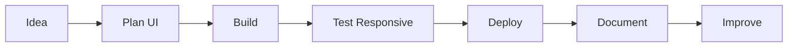

<div align="center">

# DolphinCV

### Front-End Developer | Creative Web Builder | Interactive UI Explorer

[](https://dolphincv.netlify.app/)
[](https://github.com/DolphinCV)
[](https://github.com/DolphinCV)


</div>

---

## About Me

I build responsive, clean, and interactive web experiences. My focus is front-end development, portfolio design, useful UI components, creative browser projects, and projects that feel smooth for real users.

```txt
Name: DolphinCV
Role: Front-End Developer
Focus: Responsive websites, interactive apps, clean UI
Portfolio: https://dolphincv.netlify.app/
Current mission: Build better projects and document them beautifully
```

<div align="center">

[](https://dolphincv.netlify.app/)
[](https://github.com/DolphinCV?tab=repositories)

</div>

---

## Live Snake Game

This README includes a live Snake animation powered by GitHub Actions. It eats the GitHub contribution graph and updates automatically.

<picture>
  <source media="(prefers-color-scheme: dark)" srcset="https://raw.githubusercontent.com/DolphinCV/DolphinCV/output/github-contribution-grid-snake-dark.svg">
  <source media="(prefers-color-scheme: light)" srcset="https://raw.githubusercontent.com/DolphinCV/DolphinCV/output/github-contribution-grid-snake.svg">
  
</picture>

---

## Tech Stack

<div align="center">


</div>

---

## GitHub Dashboard

<div align="center">


</div>

---

## Achievements

<div align="center">


</div>

---

## Activity Graph

<div align="center">


</div>

---

## What I Build

| Area | What I Create |
| --- | --- |
| Portfolio websites | Personal brands, developer profiles, project showcases |
| Front-end apps | Responsive interfaces, dashboards, web tools |
| JavaScript projects | Mini apps, games, interactive browser features |
| React components | Reusable UI pieces and clean component structures |
| UI polish | Layout, spacing, animation, color, and responsive behavior |
| Deployment | Netlify-hosted projects and GitHub documentation |

---

## Developer Workflow



---

## Featured Portfolio

<div align="center">

### My Main Portfolio Website

[](https://dolphincv.netlify.app/)

**Live site:** [dolphincv.netlify.app](https://dolphincv.netlify.app/)

</div>

---

## Current Focus

- Building cleaner and more useful front-end projects
- Improving JavaScript and React logic
- Creating better README files and project documentation
- Designing responsive layouts that work on mobile and desktop
- Adding more interactive features to portfolio projects

---

## Skill Progress

```txt
HTML/CSS       █████████░  90%
JavaScript     ████████░░  80%
Responsive UI  ████████░░  80%
React          ███████░░░  70%
Python         ██████░░░░  60%
Git/GitHub     ████████░░  80%
```

---

## Interactive Sections

<details>
<summary><strong>Open My Developer Card</strong></summary>

```txt
Developer: DolphinCV
Portfolio: https://dolphincv.netlify.app/
Style: Modern, clean, interactive
Likes: UI design, web animation, browser projects
Goal: Keep learning and keep shipping
```

</details>

<details>
<summary><strong>Open My Project Checklist</strong></summary>

- Clean landing page
- Responsive mobile layout
- Working navigation
- Good color contrast
- Useful project README
- Live deployment link
- Screenshots or preview
- Clear installation steps

</details>

<details>
<summary><strong>Open My README Feature List</strong></summary>

- Portfolio button
- Live Snake contribution animation
- Typing headline
- Profile views badge
- GitHub stats
- GitHub streak
- Top languages
- Trophy board
- Activity graph
- Mermaid workflow
- Skill progress section
- Collapsible interactive panels

</details>

---

## Connect With Me

<div align="center">

[](https://dolphincv.netlify.app/)
[](https://github.com/DolphinCV)

</div>

---

## Setup Note

If your GitHub username is not `DolphinCV`, replace `DolphinCV` in this README and in `.github/workflows/snake.yml` with your real GitHub username.

For the live Snake animation, push this repository to GitHub, open the **Actions** tab, run **Generate Snake**, then refresh your profile README after the workflow finishes.

---

<div align="center">

### Thanks for visiting

Building. Learning. Shipping. Improving.

</div>
